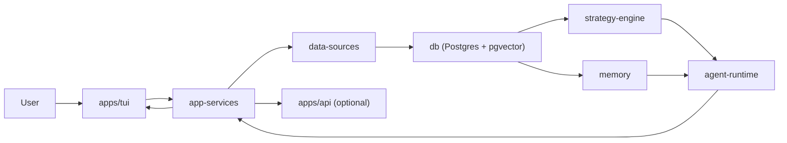
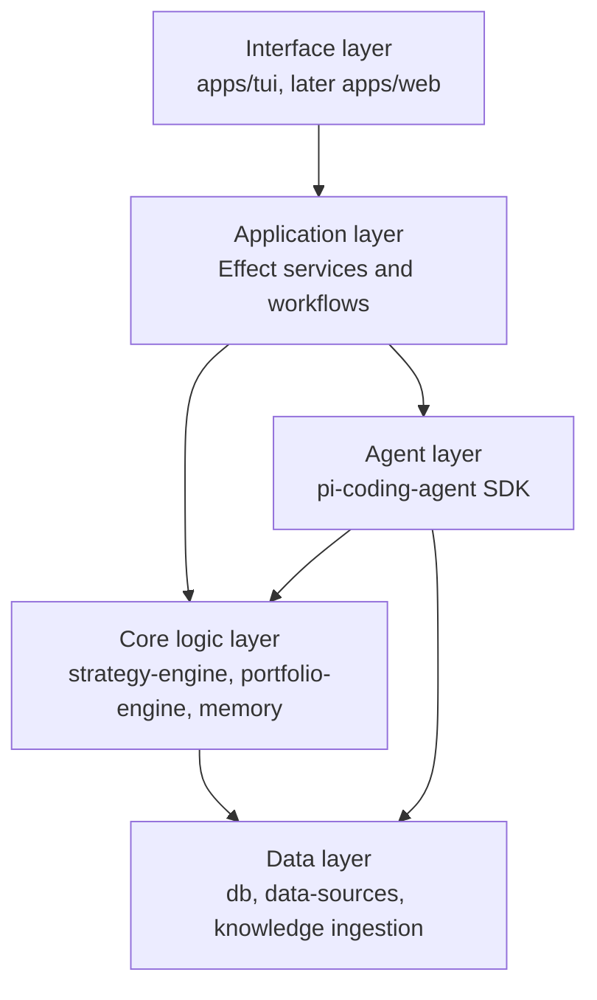
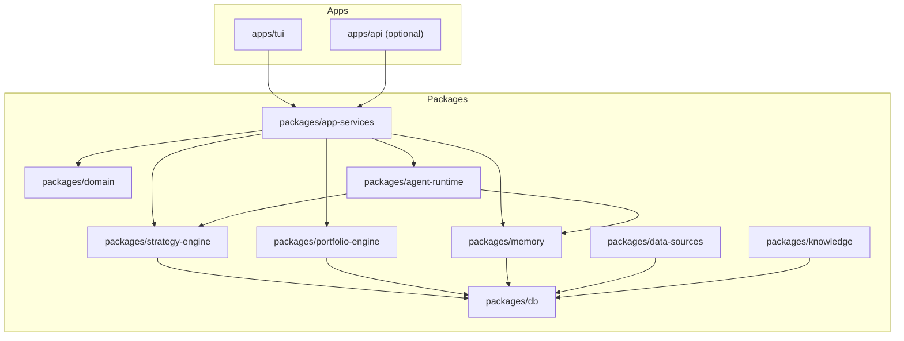
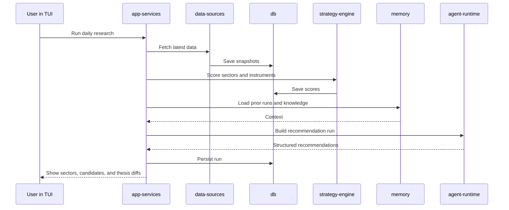
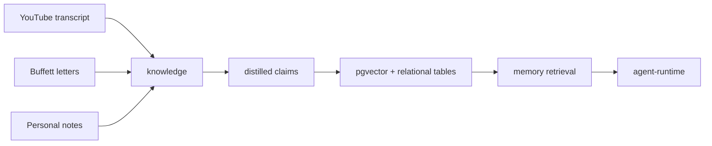

# Architecture

## Goal

This document shows the current architecture thinking in one place:

- what runs where
- what each module does
- how data moves through the system
- where `Effect`, `pi-mono`, Postgres, and the TUI fit

This is intentionally concise and implementation-oriented.

## One-Screen View

## Architecture Layers

## What Each Layer Does

| Layer | What it does | What it should not do |
| --- | --- | --- |
| Interface | Displays runs, scores, diffs, trade forms | Hold business logic |
| Application | Orchestrates jobs and use cases with Effect | Recompute strategy logic ad hoc |
| Agent | Synthesizes recommendations and explanations | Be the source of truth for raw metrics |
| Core logic | Scores sectors and instruments, checks portfolio fit, compares runs | Talk directly to the UI |
| Data | Stores facts, retrieves history, ingests source material | Decide recommendations by itself |

## Current Package Map

## Service Responsibilities

| Module | Responsibility | Main inputs | Main outputs |
| --- | --- | --- | --- |
| `apps/tui` | Operator UI for runs and review | workflows, state | commands, trade entries |
| `app-services` | Orchestrates end-to-end use cases | user intent, schedules | completed workflows |
| `data-sources` | Pulls market and source data | APIs, feeds, files | normalized raw records |
| `knowledge` | Distills transcripts and letters | transcript text, letters | `KnowledgeDocument`, `KnowledgeClaim` |
| `db` | Persists facts and history | domain records | queries and storage |
| `strategy-engine` | Scores sectors and instruments | snapshots, metrics | scores and labels |
| `portfolio-engine` | Checks diversification and fit | holdings, candidates | fit score, allocation guidance |
| `memory` | Retrieves prior runs and similar cases | history, claims, notes | context for comparison |
| `agent-runtime` | Produces structured recommendations | scores, memory, packets | verdicts, reasons, diffs |

## Main User Flow

## Knowledge Flow

## Design Rules

1. `The TUI stays thin.`
   It should call workflows, not own business logic.

2. `Effect owns orchestration.`
   Jobs, retries, dependencies, and service composition belong there.

3. `Pi SDK is the default harness.`
   Use `pi-coding-agent` sessions, resource loading, and extensions before reaching for lower-level packages.

4. `The agent does synthesis, not raw computation.`
   Scores and metrics should be computed before prompting.

5. `Memory is first-class.`
   Daily reruns, trade reflection, and reference retrieval are part of the product, not add-ons.

6. `Storage separates facts from heuristics.`
   Market facts, recommendation history, and transcript-derived claims should not be blurred together.

## V1 Runtime Decision

V1 should launch as:

- `apps/tui`
- backed by Effect services
- using `pi-coding-agent` as the default harness and `pi-tui` for custom components only
- persisting to Postgres and pgvector

`apps/api` should remain optional until we need background scheduling or external hooks.
