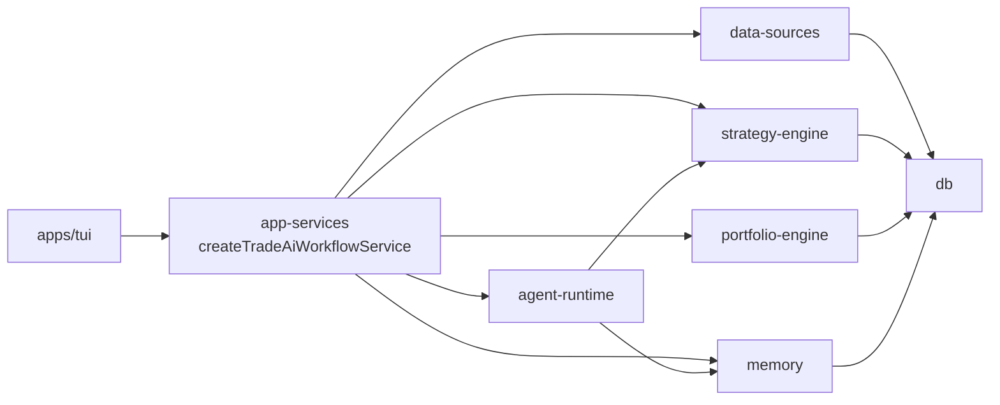

# Service Map

## At A Glance

This is the shortest readable map of the system.

| Service | What it does | Depends on |
| --- | --- | --- |
| `apps/tui` | Terminal UI for running research and reviewing results | `app-services` workflow service |
| `app-services` | Exposes `createTradeAiWorkflowService()` as the stable UI/API/plugin port | all core packages |
| `data-sources` | Pulls market, company, event, and source-material data | external APIs and files |
| `knowledge` | Converts transcripts and Buffett letters into reusable claims | `db` |
| `db` | Stores facts, runs, trades, and persisted state | Postgres now, pgvector later |
| `strategy-engine` | Scores sectors and instruments deterministically | `db`, `domain` |
| `portfolio-engine` | Checks fit, concentration, and allocation sanity | `db`, `domain` |
| `memory` | Retrieves prior runs, notes, and similar cases | `db` |
| `agent-runtime` | Turns scored packets into recommendations and explanations | `memory`, `strategy-engine`, `pi-coding-agent` |

## Main Connections



## How To Read The System

- `data-sources` gets facts into the system
- `db` stores them
- `strategy-engine` turns facts into scores
- `memory` adds history and retrieved knowledge
- `agent-runtime` turns all of that into a readable recommendation
- `app-services` exposes the UI-agnostic workflow service and keeps lower-level workflow modules internal
- `apps/tui` is one consumer of that service, not the owner of workflow logic

## Public Integration Boundary

New interfaces should depend on:

```ts
import { createTradeAiWorkflowService } from "@tradeai/app-services";

const tradeAi = createTradeAiWorkflowService({
  config: {
    brokerAccessToken,
    marketAccessToken,
    databaseUrl,
    allowPublicResearchFallback,
    persistPortfolioSnapshots,
  },
});
```

The service is the supported boundary for TUI, future API routes, web UI, and plugin/agent integrations. Runtime config, repositories, and source adapters are injected at service construction. Internal modules such as `research-workflows`, `portfolio-workflows`, and `review-workflows` remain useful for focused package tests and implementation work, but interface code should not import them directly.

## First Runnable Slice

The first meaningful vertical slice was:

1. fetch one set of instrument data
2. score it
3. retrieve any prior context
4. generate one recommendation
5. show it in the TUI
